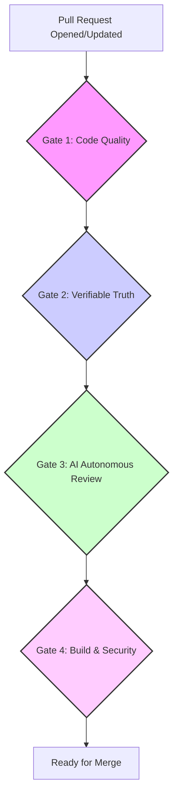

# CI/CD Golden Pipeline Standard

**VERSION:** 1.0.0
**STATUS:** STABLE

This document defines the single, mandatory CI/CD pipeline standard for all NizamIQ repositories. This "Golden Pipeline" ensures that all code changes are subjected to a rigorous, consistent, and automated quality, security, and AI review process before they can be merged.

## Architecture

The Golden Pipeline is a GitHub Actions workflow triggered on every pull request. It consists of four sequential, non-skippable gates. Each gate must pass before the next one can begin. A failure at any gate will block the pull request from being merged.



| Gate | Jobs | Purpose |
| :--- | :--- | :--- |
| **1. Code Quality** | Linting, Formatting, Static Analysis | Enforce consistent code style and catch basic errors immediately. Fails fast to provide rapid feedback. |
| **2. Verifiable Truth** | Unit & Integration Tests | Ensure the code functions as expected and meets coverage requirements. Code must be proven correct before AI review. |
| **3. AI Autonomous Review** | CodeRabbit & CodeX | Perform deep, semantic code review, identify complex bugs, and enforce NizamIQ standards. Includes a hard gate on review severity. |
| **4. Build & Security** | Compile, Build Docker Image, Scan | Verify that the application builds correctly and scan the final artifact for vulnerabilities. |

## Required Secrets & Variables

The following secrets and variables must be configured in the GitHub repository settings for the Golden Pipeline to function:

-   `secrets.OPENAI_API_KEY`: Required for both CodeRabbit and CodeX AI review jobs.
-   `secrets.CODECOV_TOKEN`: Required to upload test coverage reports to Codecov.
-   `secrets.COSIGN_PRIVATE_KEY` & `secrets.COSIGN_PASSWORD`: (Optional) For signing Docker images with Sigstore/Cosign.

## AI Agent PR Review Rules

-   **Triggering:** AI review jobs are triggered on `pull_request` events (`opened`, `synchronize`, `reopened`, `ready_for_review`).
-   **Gating:** The `codex-review` job includes a strict severity gate. The PR will be blocked (`REQUEST_CHANGES`) if the review identifies **> 0 `BLOCKERS`** or **>= 3 `MAJOR`** issues.
-   **Concurrency:** All AI review jobs use a concurrency group to ensure only one review runs at a time per PR, canceling any outdated runs.

---

## Golden Pipeline Template

This is the canonical YAML template for the Golden Pipeline (`.github/workflows/ci.yml`). It should be adapted for the specific language and framework of each repository (e.g., Python/Node.js setup, test commands), but the structure, job dependencies (`needs`), and gating logic **MUST NOT** be changed.

```yaml
name: Golden Pipeline CI

on:
  pull_request:
    branches: [ main, master, develop ]
    types: [opened, synchronize, reopened, ready_for_review]

concurrency:
  group: ${{ github.workflow }}-${{ github.event.pull_request.number || github.ref }}
  cancel-in-progress: true

jobs:
  # ===================================================================
  # GATE 1: CODE QUALITY
  # ===================================================================
  lint:
    name: Lint & Format
    runs-on: ubuntu-latest
    steps:
      - uses: actions/checkout@v4
      # Add language-specific setup (e.g., actions/setup-python@v5)
      # Add linting and formatting steps (e.g., ruff, eslint, prettier)

  # ===================================================================
  # GATE 2: VERIFIABLE TRUTH
  # ===================================================================
  test:
    name: Unit & Integration Tests
    runs-on: ubuntu-latest
    needs: lint
    steps:
      - uses: actions/checkout@v4
      # Add language-specific setup and dependency installation
      # Add test execution step (e.g., pytest, jest)
      # Add coverage reporting step (e.g., codecov/codecov-action@v4)

  # ===================================================================
  # GATE 3: AI AUTONOMOUS REVIEW
  # ===================================================================
  ai_review:
    name: AI Code Review
    runs-on: ubuntu-latest
    needs: test
    steps:
      - uses: actions/checkout@v4
      # Add AI review steps (e.g., CodeRabbitAI/review-action, codex-review-action)

  # ===================================================================
  # GATE 4: BUILD & SECURITY
  # ===================================================================
  build_and_scan:
    name: Build & Security Scan
    runs-on: ubuntu-latest
    needs: ai_review
    steps:
      - uses: actions/checkout@v4
      # Add build steps (e.g., docker build, npm run build)
      # Add security scanning steps (e.g., trivy-action, snyk-action)
```
